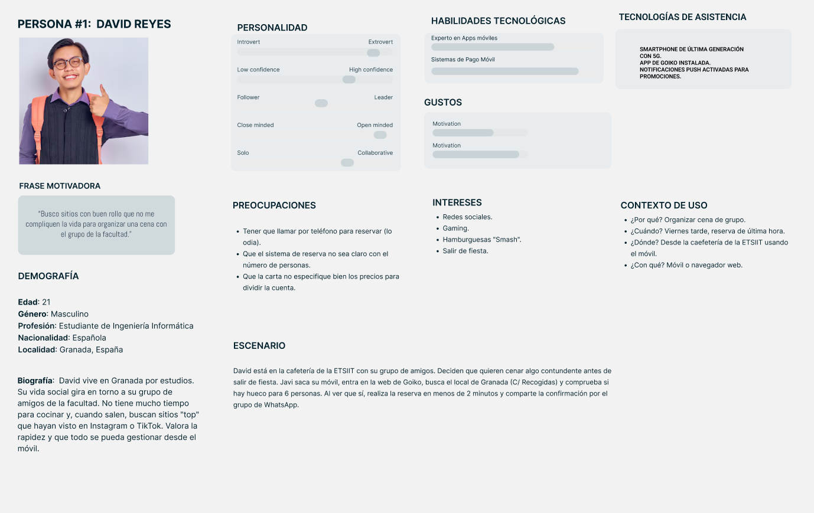
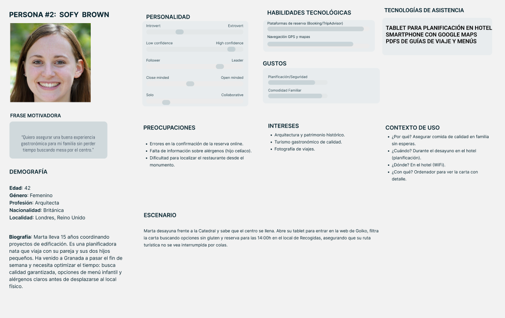
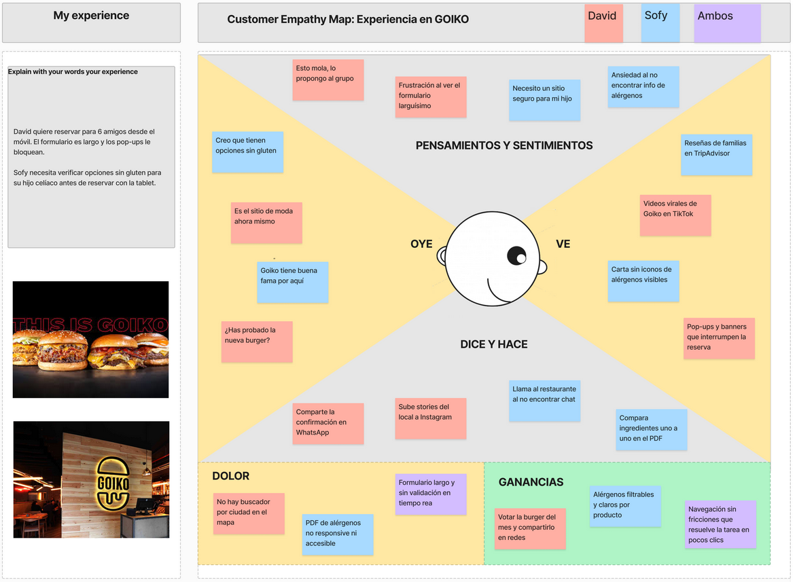
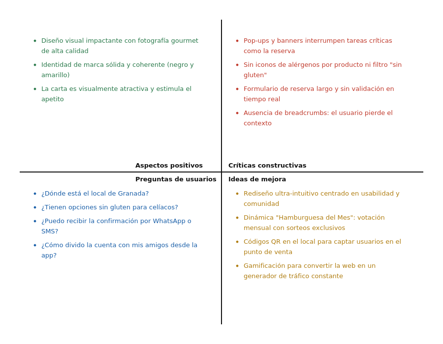
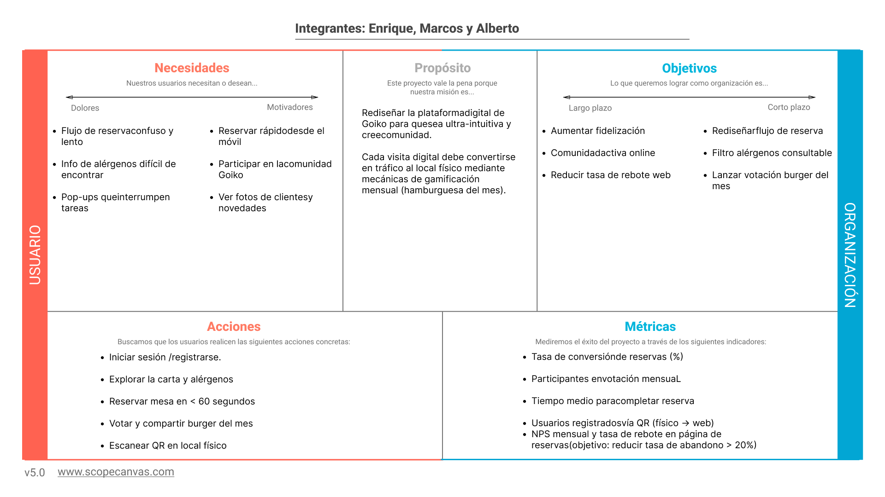

# DIU26
Prácticas Diseño Interfaces de Usuario

* [Guiones de prácticas](GuionesPracticas/)
* [Guía para crea tu Case Study](Guia_CaseStudy.md)
* Sala de la Fama [DIU Hall of fame](https://github.com/mgea/DIU/tree/master/hall_of_fame) donde se pueden encontrar Case Study destacados de otros años.
* [Recursos/plantillas en figma](https://www.figma.com/design/BN2IR0q2clOSplfMmalh9K/DIU_Toolkit_Framework--2026-)

## Paso 0 My UX-Case Study
 
-----

Grupo: DIU3.alenmar.  Curso: 2025/26 

Nombre del Proyecto: 

GOIKO

Descripción: 

Esta plataforma de hamburguesas gourmet prioriza una navegación sencilla y visual para que el usuario pida en pocos clics. Fomenta la comunidad mediante votaciones interactivas de la hamburgues del mes y un muro social que integra las fotos de los clientes en tiempo real. Está diseñada para generar tráfico constante al local, convirtiendo cada visita en una experiencia digital fluida, moderna y participativa.

Logotipo: 

>>> Si diseña un logotipo para su producto en la práctica 3 pongalo aqui, a un tamaño adecuado. Si diseña un slogan añadalo aquí

Miembros y nombre del equipo:
 * :bust_in_silhouette:  Alberto García Lara       :octocat: https://github.com/albertogxrcia    
 * :bust_in_silhouette:  Enrique Fernández Veslaco     :octocat: https://github.com/FernandezEnrique
 * :bust_in_silhouette:  Marcos Medina Peula      :octocat: https://github.com/mmpeula

----- 

 

# Proceso de Diseño 

 

## Paso 1. UX User & Desk Research & Analisis 
### 1.a User Reseach Plan
 
-----

#### 1. Antecedentes y Objetivos (The "Why")
* **Contexto:** Evaluar la usabilidad de la plataforma web de **Goiko** (escritorio y móvil) para detectar puntos de fricción en la experiencia de usuario.
* **Objetivos de investigación:** * Validar si el flujo de reserva permite confirmar una mesa en menos de 60 segundos.
    * Evaluar la visibilidad y claridad de la información sobre alérgenos y productos locales (hamburguesa especial de Granada).
* **Experiencia del equipo:** Actuamos como **observadores**, analizando cómo la interfaz traduce la experiencia física de una hamburguesería gourmet al entorno digital.

#### 2. Metodología (The "How")
* **Cualitativa :** Entrevistas semiestructuradas para conocer la percepción de marca.
* **Cualitativa:** Test de usabilidad para observar problemas de navegación en tiempo real.
* **Cuantitativa:** Tras la realización de las tareas, obtener una métrica de satisfacción estandarizada.

#### 3. Perfil de los Participantes (The "Who")
Se han seleccionado perfiles que representan los extremos del uso tecnológico:
* **Criterios de inclusión:** Usuarios residentes o turistas en Granada, de 20 a 50 años, usuarios habituales de móvil..
* **Segmentación:**
    * **David Reyes:** Estudiante universitario, nativo digital, busca rapidez e impacto visual.
    * **Sofy Brown:** Profesional y madre de familia, busca seguridad, planificación y detalles sobre alérgenos.

#### 4. Guion y Tareas (The "What")
Se solicitará a los usuarios completar las siguientes acciones en la web de Goiko:
1. **Búsqueda de producto:** "Localiza los ingredientes de la hamburguesa BEST SELLER".
2. **Conversión/Reserva:** "Reserva mesa para 4 personas el próximo sábado a las 21:00h en el local de la calle Recogidas".
3. **Consulta técnica:** "Encuentra la sección de alérgenos y verifica las opciones para celíacos".

#### 5. Cronograma y Entregables
Lista de documentos resultantes de la investigación:
* **User Persona:** Fichas de David y Sofy.
* **Experience Journey Map:** Mapeo de la experiencia de ambos perfiles.
* **Resumen Ejecutivo:** Informe final con recomendaciones de mejora de usabilidad. 

### 1.b Competitive Analysis
 
-----
Hemos decidido de entre las opciones centrarnos en la experiencia de comida rápida gourmet con la página de **"Goiko"**. Consideramos que hay más aspectos que mejorar en esta página frente a las otras, especialmente en la **saturación de elementos visuales**, por lo que podremos detectar oportunidades de mejora y optimizar la usabilidad de esta plataforma.

Como vamos a centrarnos en el tema de las hamburgueserías premium, analizaremos **"Goiko"** frente a otras páginas web como **"Mostaza Green"** y **"Kiko Undefiled Burger"**, que son empresas del sector con enfoques distintos en cuanto a marketing y producto. 

* **Goiko:** Aunque su web es la más robusta tecnológicamente, su flujo de reserva puede resultar confuso. 
* **Mostaza Green:** El enfoque es más local y cercano, con una interfaz más sencilla de navegar. 
* **Kiko Undefiled Burger:** Apuesta por un estilo minimalista y artesanal, siendo muy útil para comparar cómo se gestiona la exclusividad del producto sin distracciones.

Ahora hemos realizado un análisis para comparar los puntos fuertes de las tres páginas y detectar posibles áreas de mejora, tomando como referencia los aspectos positivos de las otras webs:

* [https://www.goiko.com/es/](https://www.goiko.com/es/)
* [https://mostazagreen.com/](https://mostazagreen.com/)
* [https://kikoundefiledburger.com/](https://kikoundefiledburger.com/)
  

### 1.c Personas
 
-----
Por un lado tenemos a **David Reyes**, un joven estudiante nativo digital muy activo en redes sociales que busca rapidez y planes grupales en tendencia.

Por otro lado tenemos a **Sofy Brown**, una arquitecta y madre de familia en viaje de turismo que necesita planificar con seguridad y detalle su experiencia gastronómica.

### 1.d User Journey Map

----

La primera experiencia, de **David Reyes**, representa a un usuario nativo digital que descubre Goiko a través de TikTok y quiere organizar una quedada rápida con sus colegas. Este perfil es muy habitual: jóvenes que buscan inmediatez, reservan desde el móvil a última hora y valoran poder compartir la experiencia en redes. Los principales pain points detectados son la lentitud de carga en móvil, la falta de un buscador por ciudad y un formulario de reserva demasiado extenso.

La segunda experiencia, de **Sofy Brown**, representa a una usuaria planificadora que viaja con familia y tiene necesidades específicas (hijo celíaco). Este perfil también es frecuente en turismo gastronómico: usuarios que investigan antes de ir, necesitan información clara sobre alérgenos y quieren asegurarse de que el restaurante cumple sus expectativas. Los pain points principales son la dificultad para encontrar información de alérgenos, el PDF poco accesible y la falta de filtros en la carta.

  

### 1.e Usability Review

----

La página de Goiko ha obtenido un **72 sobre 100**.

En cuanto a la estética, Goiko ofrece una interfaz visualmente impactante y profesional. El uso de fotografía gastronómica de alta resolución y su paleta de colores corporativa (negro y amarillo) logran una inmersión inmediata que estimula el apetito y refuerza su identidad de marca. Navegar por su carta es una experiencia placentera a la vista, manteniendo una coherencia gráfica de alto nivel en casi todas sus secciones.

Sin embargo, a nivel de diseño y usabilidad funcional, la página presenta aspectos negativos que penalizan la experiencia del usuario. El principal problema es la saturación visual y el exceso de "ruido" publicitario; la aparición constante de pop-ups y banners promocionales interrumpe tareas críticas, como la reserva de mesa. Se detecta una falta de ayuda contextual clara: al personalizar ingredientes o elegir puntos de carne, el sistema asume que el usuario conoce todas las opciones sin ofrecer explicaciones breves, lo que puede generar dudas. Además, existe una carencia importante de migas de pan (breadcrumbs), lo que provoca que, tras profundizar en la carta o en el blog, el usuario pierda la noción de su ubicación exacta y deba recurrir constantemente al menú principal para retroceder.

Finalmente, el proceso de reserva tiene un margen de mejora considerable. Aunque es funcional, el formulario resulta excesivamente largo y carece de una validación en tiempo real robusta. Al igual que ocurre con la inconsistencia en el formato de sus botones de acción, el sistema no siempre indica claramente qué campos son obligatorios hasta que se intenta enviar el formulario, lo que genera frustración. En definitiva, es una web diseñada para impactar emocionalmente, pero que descuida la eficiencia operativa del usuario que busca completar una tarea de forma rápida y sin distracciones.

- **Enlace al documento:** [Goiko_Usability_Review_2026](P1/Goiko_Usability_Review_2026.pdf)
  

### 1.f Briefing
----

Tras realizar un análisis técnico y de usabilidad de la plataforma de Goiko, el diagnóstico revela una **desconexión crítica** entre el diseño visual (UI) y la arquitectura funcional (UX). Aunque el frontend es de alto impacto visual (72/100), la plataforma presenta "bloqueos" operativos que lastran la tasa de conversión.

#### Hallazgos Técnicos y de Interfaz:

* **Persistencia de Sesión e Idioma:** Se ha identificado un bug de persistencia: el selector de idioma no mantiene el estado al navegar entre endpoints o pestañas, forzando el retorno al español. Esto rompe la experiencia para el segmento de usuarios internacionales, generando una fricción innecesaria en el flujo de navegación.
* **Arquitectura de la Información y Navegación:** La ausencia de breadcrumbs (migas de pan) y una jerarquía difusa provocan que el usuario pierda el contexto de su ubicación tras realizar tres o más clics. Además, el acceso al Club Goiko no es intuitivo; la lógica de negocio de las promociones está mal implementada a nivel de interfaz, ocultando los beneficios tras capas de navegación poco claras.
* **Optimización del Flujo de Reserva:** El formulario de reserva presenta una carga cognitiva excesiva. Carece de validación de datos en tiempo real (lado del cliente), lo que provoca errores de envío frustrantes. A esto se suma el "ruido" de scripts publicitarios y pop-ups que interrumpen tareas críticas, penalizando la eficiencia del proceso.

#### Recomendaciones Técnicas:

Es nceserio corregir la gestión de estados del idioma y sustituir los menús de alérgenos en formato PDF por una base de datos consultable y filtrable. Se recomienda una simplificación del checkout de reserva y una reestructuración del módulo de fidelización para reducir la tasa de rebote y optimizar el rendimiento general de la plataforma.

 

## Paso 2. UX Design  

### 2.a Reframing / IDEACION: Feedback Capture Grid / EMpathy map 
 
----

A continuación, se presenta el mapa de empatía elaborado a partir de las experiencias y necesidades identificadas en la práctica anterior, con el objetivo de comprender mejor al usuario y guiar el diseño centrado en sus emociones, pensamientos y comportamientos.

A modo general de ambos usuarios, y para remarcar los aspectos más importantes, recurrimos también a un Feedback Capture Grid: 

    
#### Estrategia de Revitalización Digital: Hamburguesería

##### 1. El Problema 🍔
Actualmente, la plataforma digital presenta una **interfaz obsoleta y poco funcional**. Esta deficiencia técnica y estética genera una fricción innecesaria en el proceso de compra, lo que deriva en las siguientes consecuencias:

* **Abandono de Reserva:** Los usuarios desisten antes de hacer su reserva debido a la mala experiencia de usuario (UX).
* **Desconexión Digital:** Falta de uso generalizada por parte de los clientes habituales.
* **Oportunidad Perdida:** No existe un puente eficaz para fidelizar a los consumidores presenciales.

#### 2. Hipótesis y Propuesta de Valor 💡

##### El Enfoque "Ultra-Intuitivo"
Planteamos que, al rediseñar la web bajo un enfoque centrado en la **usabilidad y la comunidad**, incrementaremos significativamente el tráfico y la recurrencia de los clientes.

##### Valor Añadido: Experiencia Participativa
La plataforma se transformará en un espacio de interacción activa mediante la dinámica de la **"Hamburguesa del Mes"**:

1.  **Captación en Punto de Venta:** Implementación de códigos QR en el local físico.
2.  **Gamificación:** Invitación directa a los usuarios para votar por su creación favorita.
3.  **Incentivo Real:** Sorteos exclusivos para probar la *burger* ganadora.

> **Tesis Principal:** Si incentivamos la votación mediante sorteos, generaremos una expectativa mensual que transformará una web estática en un generador de tráfico constante hacia el punto de venta físico.

#### 3. Tesis Principal 📌

> "Si incentivamos la participación mediante una dinámica de votación y recompensas, transformaremos una web estática en un **motor de expectativa mensual**. Esto no solo mejora la usabilidad, sino que convierte la plataforma en un generador constante de tráfico hacia el punto de venta físico u online, fortaleciendo el engagement con la comunidad."

### 2.b ScopeCanvas

 

### 2.b User Flow (task) analysis 
En nuestra matriz de tareas de usuario, hemos recopilado las funciones de nuestra web y como de relevante serían para cada tipo de usuario. Hemos añadido tres tipos de usuarios, dando las prioridades de alta (H), media (M) y baja (L):

| Tarea | Clientes | Comunidad | Administradores |
|---|---|---|---|
| Iniciar sesión / registrarse | H | H | H |
| Reservar mesa | H | M | H |
| Consultar carta | H | H | M |
| Filtrar por alérgenos | H | M | L |
| Votar burger del mes | M | H | M |
| Participar en sorteo | M | H | L |
| Ver muro social / fotos | M | H | M |
| Escanear QR en local | H | M | L |
| Acceder al Club Goiko | M | H | M |
| Resolver dudas con soporte | H | L | H |

Y hemos mostrado el flujo de tres tareas que consideramos las más importantes:
### 

 
-----

Este diagrama muestra el recorrido que realiza el usuario dentro de nuestra propuesta digital, desde el acceso inicial hasta la consecución de sus objetivos principales. Nos permite identificar los pasos clave, optimizar la experiencia de navegación y garantizar que cada interacción esté alineada con las necesidades y expectativas del usuario.

### 2.c IA: Sitemap + Labelling 
 
----
Este sitemap representa la arquitectura de información propuesta para nuestro proyecto. Su objetivo es organizar de forma lógica y jerárquica los contenidos y secciones de la interfaz, facilitando la navegación del usuario y asegurando una experiencia clara, intuitiva y coherente desde el inicio.

Término | Significado     
| ------------- | -------
  Login  | acceder a plataforma

### 2.d Wireframes
 
-----

>>> Plantear el diseño del layout para Web/movil (organización y simulación). Describa la herramienta usada 

 

## Paso 3. Mi UX-Case Study (diseño)

>>> Cualquier título puede ser adaptado. Recuerda borrar estos comentarios del template en tu documento

### 3.a Moodboard

-----

>>> Diseño visual con una guía de estilos visual (moodboard) 
>>> Incluir Logotipo. Todos los recursos estarán subidos a la carpeta P3/
>>> Explique aqui la/s herramienta/s utilizada/s y el por qué de la resolución empleada. Reflexione ¿Se puede usar esta imagen como cabecera de Instagram, por ejemplo, o se necesitan otras?

### 3.b Landing Page
 
----

>>> Plantear el Landing Page del producto. Aplica estilos definidos en el moodboard

### 3.c Guidelines
 
----

>>> Estudio de Guidelines y explicación de los Patrones IU a usar 
>>> Es decir, tras documentarse, muestre las deciones tomadas sobre Patrones IU a usar para la fase siguiente de prototipado. 

### 3.d Mockup
 
----

>>> Consiste en tener un Layout en acción. Un Mockup es un prototipo HTML que permite simular tareas con estilo de IU seleccionado. Muy útil para compartir con stakeholders

 

## Paso 4. Pruebas de Evaluación 

### 4.a Reclutamiento de usuarios 

-----

>>> Breve descripción del caso asignado (llamado Caso-B) con enlace al repositorio Github
>>> Tabla y asignación de personas ficticias (o reales) a las pruebas. Exprese las ideas de posibles situaciones conflictivas de esa persona en las propuestas evaluadas. Mínimo 4 usuarios: asigne 2 al Caso A y 2 al caso B.

| Usuarios | Sexo/Edad     | Ocupación   |  Exp.TIC    | Personalidad | Plataforma | Caso
| ------------- | -------- | ----------- | ----------- | -----------  | ---------- | ----
| User1's name  | H / 18   | Estudiante  | Media       | Introvertido | Web.       | A 
| User2's name  | H / 18   | Estudiante  | Media       | Timido       | Web        | A 
| User3's name  | M / 35   | Abogado     | Baja        | Emocional    | móvil      | B 
| User4's name  | H / 18   | Estudiante  | Media       | Racional     | Web        | B 

### 4.b Diseño de las pruebas 
 
-----

>>> Planifique qué pruebas se van a desarrollar. ¿En qué consisten? ¿Se hará uso del checklist de la P1?

### 4.c Cuestionario SUS
 
----

>>> Como uno de los test para la prueba A/B testing, usaremos el **Cuestionario SUS** que permite valorar la satisfacción de cada usuario con el diseño utilizado (casos A o B). Para calcular la valoración numérica y la etiqueta linguistica resultante usamos la [hoja de cálculo](https://github.com/mgea/DIU19/blob/master/Cuestionario%20SUS%20DIU.xlsx). Previamente conozca en qué consiste la escala SUS y cómo se interpretan sus resultados
http://usabilitygeek.com/how-to-use-the-system-usability-scale-sus-to-evaluate-the-usability-of-your-website/)
Para más información, consultar aquí sobre la [metodología SUS](https://cui.unige.ch/isi/icle-wiki/_media/ipm:test-suschapt.pdf)
>>> Adjuntar en la carpeta P4/ el excel resultante y describa aquí la valoración personal de los resultados 

### 4.d A/B Testing
 
-----

>>> Los resultados de un A/B testing con 3 pruebas y 2 casos o alternativas daría como resultado una tabla de 3 filas y 2 columnas, además de un resultado agregado global. Especifique con claridad el resultado: qué caso es más usable, A o B?

### 4.e Aplicación del método Eye Tracking 

----

>>> Indica cómo se diseña el experimento y se reclutan los usuarios. Explica la herramienta / uso de gazerecorder.com u otra similar. Aplíquese únicamente al caso B.

  
>>> Cambiar esta img por una de vuestro experimento. El recurso deberá estar subido a la carpeta P4/  

>>> gazerecorder en versión de pruebas puede estar limitada a 3 usuarios para generar mapa de calor (crédito > 0 para que funcione) 

### 4.f Usability Report de B
 
-----

>>> Añadir report de usabilidad para práctica B (la de los compañeros) aportando resultados y valoración de cada debilidad de usabilidad. 
>>> Enlazar aqui con el archivo subido a P4/ que indica qué equipo evalua a qué otro equipo.

>>> Complementad el Case Study en su Paso 4 con una Valoración personal del equipo sobre esta tarea

 

## Paso 5. Exportación y Documentación 

### 5.a Exportación a HTML/React
 
----

>>> Breve descripción de esta tarea. Las evidencias de este paso quedan subidas a P5/

### 5.b Documentación con Storybook

----

>>> Breve descripción de esta tarea. Las evidencias de este paso quedan subidas a P5/

 

## Conclusiones finales & Valoración de las prácticas

>>> Opinión FINAL del proceso de desarrollo de diseño siguiendo metodología UX y valoración (positiva /negativa) de los resultados obtenidos. ¿Qué se puede mejorar? Recuerda que este tipo de texto se debe eliminar del template que se os proporciona 

