# DIU26
Prácticas Diseño Interfaces de Usuario

* [Nuestra Web](https://cupid-bubble-98659507.figma.site)

## Paso 0 My UX-Case Study
 
-----

Grupo: DIU3.alenmar.  Curso: 2025/26 

Nombre del Proyecto: 

GOIKO

Descripción: 

Esta plataforma de hamburguesas gourmet prioriza una navegación sencilla y visual para que el usuario pida en pocos clics. Fomenta la comunidad mediante votaciones interactivas de la hamburgues del mes y un muro social que integra las fotos de los clientes en tiempo real. Está diseñada para generar tráfico constante al local, convirtiendo cada visita en una experiencia digital fluida, moderna y participativa.

Logotipo: 

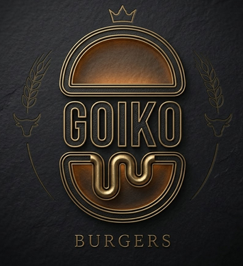

Miembros y nombre del equipo:
 * :bust_in_silhouette:  Alberto García Lara       :octocat: https://github.com/albertogxrcia    
 * :bust_in_silhouette:  Enrique Fernández Veslaco     :octocat: https://github.com/FernandezEnrique
 * :bust_in_silhouette:  Marcos Medina Peula      :octocat: https://github.com/mmpeula

----- 

<br>

# Proceso de Diseño 

<br>

## Paso 1. UX User & Desk Research & Analisis 
### 1.a User Reseach Plan
 
-----

#### 1. Antecedentes y Objetivos (The "Why")
* **Contexto:** Evaluar la usabilidad de la plataforma web de **Goiko** (escritorio y móvil) para detectar puntos de fricción en la experiencia de usuario.
* **Objetivos de investigación:** * Validar si el flujo de reserva permite confirmar una mesa en menos de 60 segundos.
    * Evaluar la visibilidad y claridad de la información sobre alérgenos y productos locales (hamburguesa especial de Granada).
* **Experiencia del equipo:** Actuamos como **observadores**, analizando cómo la interfaz traduce la experiencia física de una hamburguesería gourmet al entorno digital.

#### 2. Metodología (The "How")
* **Cualitativa :** Entrevistas semiestructuradas para conocer la percepción de marca.
* **Cualitativa:** Test de usabilidad para observar problemas de navegación en tiempo real.
* **Cuantitativa:** Tras la realización de las tareas, obtener una métrica de satisfacción estandarizada.

#### 3. Perfil de los Participantes (The "Who")
Se han seleccionado perfiles que representan los extremos del uso tecnológico:
* **Criterios de inclusión:** Usuarios residentes o turistas en Granada, de 20 a 50 años, usuarios habituales de móvil..
* **Segmentación:**
    * **David Reyes:** Estudiante universitario, nativo digital, busca rapidez e impacto visual.
    * **Sofy Brown:** Profesional y madre de familia, busca seguridad, planificación y detalles sobre alérgenos.

#### 4. Guion y Tareas (The "What")
Se solicitará a los usuarios completar las siguientes acciones en la web de Goiko:
1. **Búsqueda de producto:** "Localiza los ingredientes de la hamburguesa BEST SELLER".
2. **Conversión/Reserva:** "Reserva mesa para 4 personas el próximo sábado a las 21:00h en el local de la calle Recogidas".
3. **Consulta técnica:** "Encuentra la sección de alérgenos y verifica las opciones para celíacos".

#### 5. Cronograma y Entregables
Lista de documentos resultantes de la investigación:
* **User Persona:** Fichas de David y Sofy.
* **Experience Journey Map:** Mapeo de la experiencia de ambos perfiles.
* **Resumen Ejecutivo:** Informe final con recomendaciones de mejora de usabilidad. 


### 1.b Competitive Analysis
 
-----
Hemos decidido de entre las opciones centrarnos en la experiencia de comida rápida gourmet con la página de **"Goiko"**. Consideramos que hay más aspectos que mejorar en esta página frente a las otras, especialmente en la **saturación de elementos visuales**, por lo que podremos detectar oportunidades de mejora y optimizar la usabilidad de esta plataforma.

Como vamos a centrarnos en el tema de las hamburgueserías premium, analizaremos **"Goiko"** frente a otras páginas web como **"Mostaza Green"** y **"Kiko Undefiled Burger"**, que son empresas del sector con enfoques distintos en cuanto a marketing y producto. 

* **Goiko:** Aunque su web es la más robusta tecnológicamente, su flujo de reserva puede resultar confuso. 
* **Mostaza Green:** El enfoque es más local y cercano, con una interfaz más sencilla de navegar. 
* **Kiko Undefiled Burger:** Apuesta por un estilo minimalista y artesanal, siendo muy útil para comparar cómo se gestiona la exclusividad del producto sin distracciones.

Ahora hemos realizado un análisis para comparar los puntos fuertes de las tres páginas y detectar posibles áreas de mejora, tomando como referencia los aspectos positivos de las otras webs:

* [https://www.goiko.com/es/](https://www.goiko.com/es/)
* [https://mostazagreen.com/](https://mostazagreen.com/)
* [https://kikoundefiledburger.com/](https://kikoundefiledburger.com/)
  


### 1.c Personas
 
-----
Por un lado tenemos a **David Reyes**, un joven estudiante nativo digital muy activo en redes sociales que busca rapidez y planes grupales en tendencia.


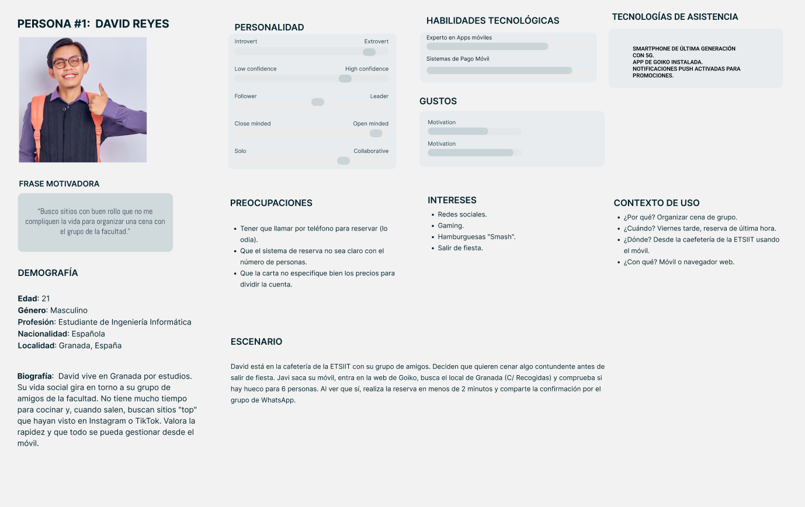


Por otro lado tenemos a **Sofy Brown**, una arquitecta y madre de familia en viaje de turismo que necesita planificar con seguridad y detalle su experiencia gastronómica.


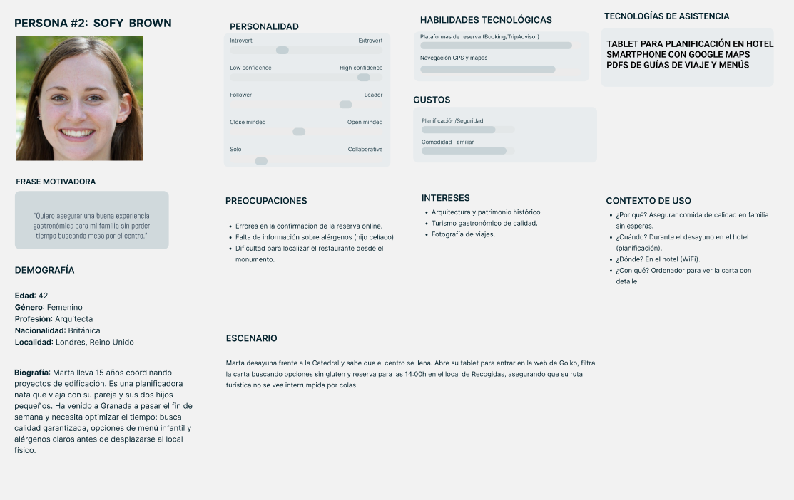


### 1.d User Journey Map

----

La primera experiencia, de **David Reyes**, representa a un usuario nativo digital que descubre Goiko a través de TikTok y quiere organizar una quedada rápida con sus colegas. Este perfil es muy habitual: jóvenes que buscan inmediatez, reservan desde el móvil a última hora y valoran poder compartir la experiencia en redes. Los principales pain points detectados son la lentitud de carga en móvil, la falta de un buscador por ciudad y un formulario de reserva demasiado extenso.


La segunda experiencia, de **Sofy Brown**, representa a una usuaria planificadora que viaja con familia y tiene necesidades específicas (hijo celíaco). Este perfil también es frecuente en turismo gastronómico: usuarios que investigan antes de ir, necesitan información clara sobre alérgenos y quieren asegurarse de que el restaurante cumple sus expectativas. Los pain points principales son la dificultad para encontrar información de alérgenos, el PDF poco accesible y la falta de filtros en la carta.

  


### 1.e Usability Review

----

La página de Goiko ha obtenido un **72 sobre 100**.

En cuanto a la estética, Goiko ofrece una interfaz visualmente impactante y profesional. El uso de fotografía gastronómica de alta resolución y su paleta de colores corporativa (negro y amarillo) logran una inmersión inmediata que estimula el apetito y refuerza su identidad de marca. Navegar por su carta es una experiencia placentera a la vista, manteniendo una coherencia gráfica de alto nivel en casi todas sus secciones.

Sin embargo, a nivel de diseño y usabilidad funcional, la página presenta aspectos negativos que penalizan la experiencia del usuario. El principal problema es la saturación visual y el exceso de "ruido" publicitario; la aparición constante de pop-ups y banners promocionales interrumpe tareas críticas, como la reserva de mesa. Se detecta una falta de ayuda contextual clara: al personalizar ingredientes o elegir puntos de carne, el sistema asume que el usuario conoce todas las opciones sin ofrecer explicaciones breves, lo que puede generar dudas. Además, existe una carencia importante de migas de pan (breadcrumbs), lo que provoca que, tras profundizar en la carta o en el blog, el usuario pierda la noción de su ubicación exacta y deba recurrir constantemente al menú principal para retroceder.

Finalmente, el proceso de reserva tiene un margen de mejora considerable. Aunque es funcional, el formulario resulta excesivamente largo y carece de una validación en tiempo real robusta. Al igual que ocurre con la inconsistencia en el formato de sus botones de acción, el sistema no siempre indica claramente qué campos son obligatorios hasta que se intenta enviar el formulario, lo que genera frustración. En definitiva, es una web diseñada para impactar emocionalmente, pero que descuida la eficiencia operativa del usuario que busca completar una tarea de forma rápida y sin distracciones.

- **Enlace al documento:** [Goiko_Usability_Review_2026](P1/Goiko_Usability_Review_2026.pdf)
  

### 1.f Briefing
----

Tras realizar un análisis técnico y de usabilidad de la plataforma de Goiko, el diagnóstico revela una **desconexión crítica** entre el diseño visual (UI) y la arquitectura funcional (UX). Aunque el frontend es de alto impacto visual (72/100), la plataforma presenta "bloqueos" operativos que lastran la tasa de conversión.

#### Hallazgos Técnicos y de Interfaz:

* **Persistencia de Sesión e Idioma:** Se ha identificado un bug de persistencia: el selector de idioma no mantiene el estado al navegar entre endpoints o pestañas, forzando el retorno al español. Esto rompe la experiencia para el segmento de usuarios internacionales, generando una fricción innecesaria en el flujo de navegación.
* **Arquitectura de la Información y Navegación:** La ausencia de breadcrumbs (migas de pan) y una jerarquía difusa provocan que el usuario pierda el contexto de su ubicación tras realizar tres o más clics. Además, el acceso al Club Goiko no es intuitivo; la lógica de negocio de las promociones está mal implementada a nivel de interfaz, ocultando los beneficios tras capas de navegación poco claras.
* **Optimización del Flujo de Reserva:** El formulario de reserva presenta una carga cognitiva excesiva. Carece de validación de datos en tiempo real (lado del cliente), lo que provoca errores de envío frustrantes. A esto se suma el "ruido" de scripts publicitarios y pop-ups que interrumpen tareas críticas, penalizando la eficiencia del proceso.

#### Recomendaciones Técnicas:

Es nceserio corregir la gestión de estados del idioma y sustituir los menús de alérgenos en formato PDF por una base de datos consultable y filtrable. Se recomienda una simplificación del checkout de reserva y una reestructuración del módulo de fidelización para reducir la tasa de rebote y optimizar el rendimiento general de la plataforma.

<br>

## Paso 2. UX Design  

### 2.a Reframing / IDEACION: Feedback Capture Grid / EMpathy map 
 
----

A continuación, se presenta el mapa de empatía elaborado a partir de las experiencias y necesidades identificadas en la práctica anterior, con el objetivo de comprender mejor al usuario y guiar el diseño centrado en sus emociones, pensamientos y comportamientos.

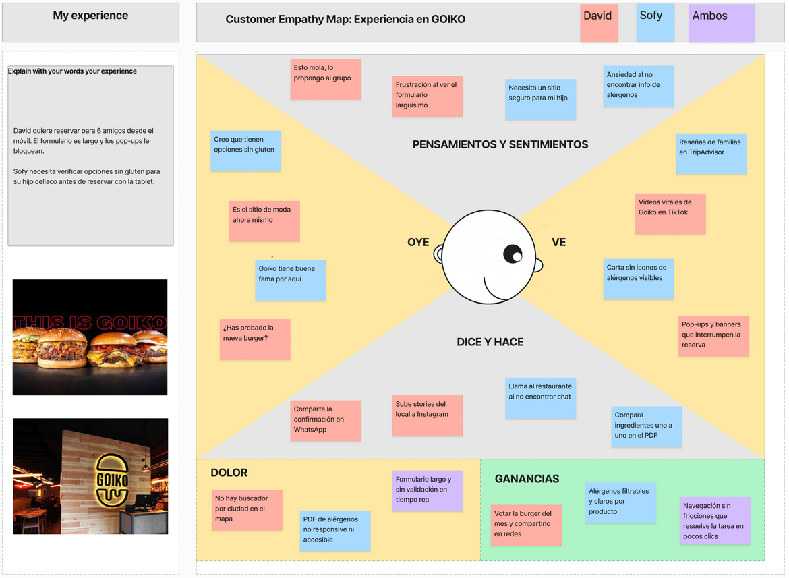


A modo general de ambos usuarios, y para remarcar los aspectos más importantes, recurrimos también a un Feedback Capture Grid: 

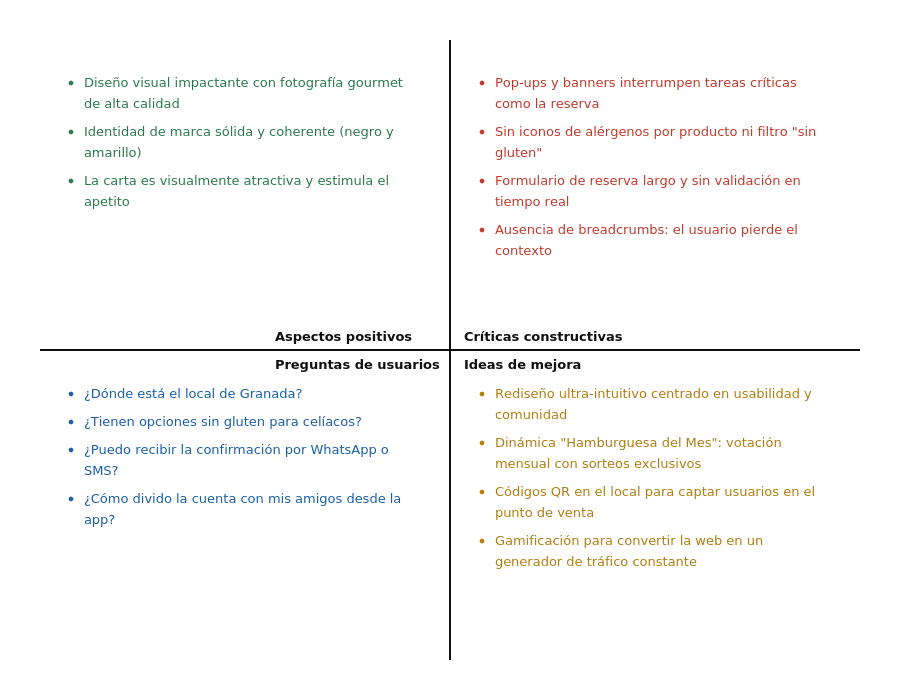

    
#### Estrategia de Revitalización Digital: Hamburguesería

##### 1. El Problema 🍔
Actualmente, la plataforma digital presenta una **interfaz obsoleta y poco funcional**. Esta deficiencia técnica y estética genera una fricción innecesaria en el proceso de compra, lo que deriva en las siguientes consecuencias:

* **Abandono de Reserva:** Los usuarios desisten antes de hacer su reserva debido a la mala experiencia de usuario (UX).
* **Desconexión Digital:** Falta de uso generalizada por parte de los clientes habituales.
* **Oportunidad Perdida:** No existe un puente eficaz para fidelizar a los consumidores presenciales.


#### 2. Hipótesis y Propuesta de Valor 💡

##### El Enfoque "Ultra-Intuitivo"
Planteamos que, al rediseñar la web bajo un enfoque centrado en la **usabilidad y la comunidad**, incrementaremos significativamente el tráfico y la recurrencia de los clientes.

##### Valor Añadido: Experiencia Participativa
La plataforma se transformará en un espacio de interacción activa mediante la dinámica de la **"Hamburguesa del Mes"**:

1.  **Captación en Punto de Venta:** Implementación de códigos QR en el local físico.
2.  **Gamificación:** Invitación directa a los usuarios para votar por su creación favorita.
3.  **Incentivo Real:** Sorteos exclusivos para probar la *burger* ganadora.

También implementaremos la opción de comprar la "Hamburguesa del Mes" con un solo clic directamente desde la página principal.

> **Tesis Principal:** Si incentivamos la votación mediante sorteos, generaremos una expectativa mensual que transformará una web estática en un generador de tráfico constante hacia el punto de venta físico.

#### 3. Tesis Principal 📌

> "Si incentivamos la participación mediante una dinámica de votación y recompensas, transformaremos una web estática en un **motor de expectativa mensual**. Esto no solo mejora la usabilidad, sino que convierte la plataforma en un generador constante de tráfico hacia el punto de venta físico u online, fortaleciendo el engagement con la comunidad."


### 2.b ScopeCanvas

----

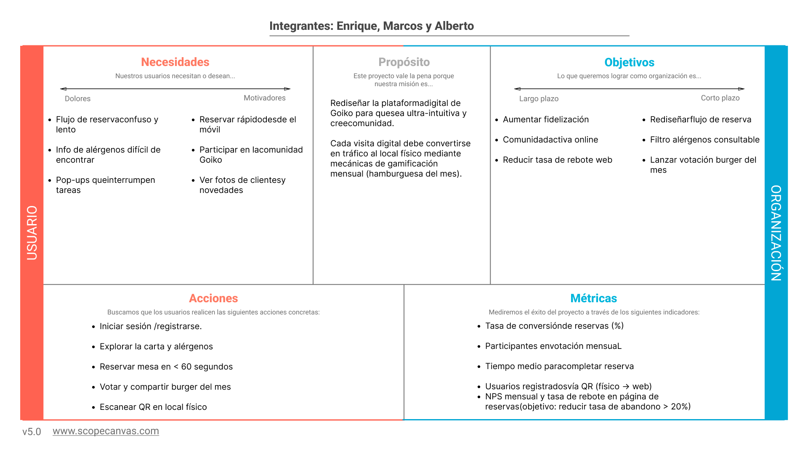 


### 2.b User Flow (task) analysis 

----

En nuestra matriz de tareas de usuario, hemos recopilado las funciones de nuestra web y como de relevante serían para cada tipo de usuario. Hemos añadido tres tipos de usuarios, dando las prioridades de alta (H), media (M) y baja (L):

| Tarea | Clientes | Comunidad | Administradores |
|---|---|---|---|
| Iniciar sesión / registrarse | H | H | H |
| Reservar mesa | H | M | H |
| Consultar carta | H | H | M |
| Filtrar por alérgenos | H | M | L |
| Votar burger del mes | M | H | M |
| Participar en sorteo | M | H | L |
| Ver muro social / fotos | M | H | M |
| Escanear QR en local | H | M | L |
| Acceder al Club Goiko | M | H | M |
| Resolver dudas con soporte | H | L | H |

Y hemos mostrado el flujo de tres tareas que consideramos las más importantes:
### Votar hamburguesa del mes
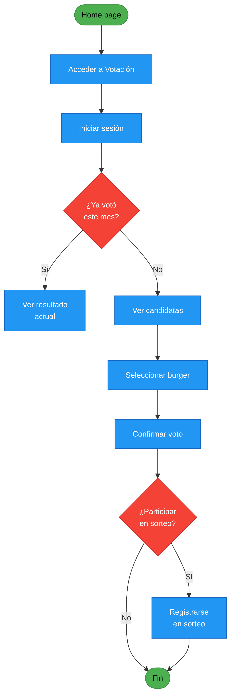

### Reservar mesa
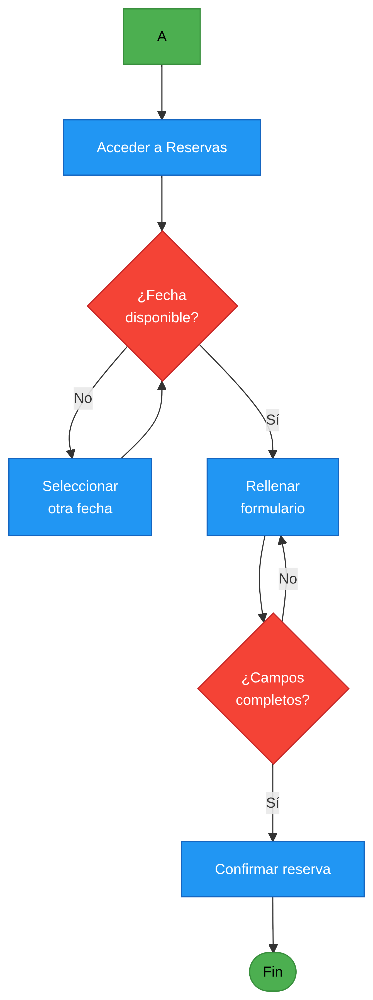

### Ver la carta (Alergias)
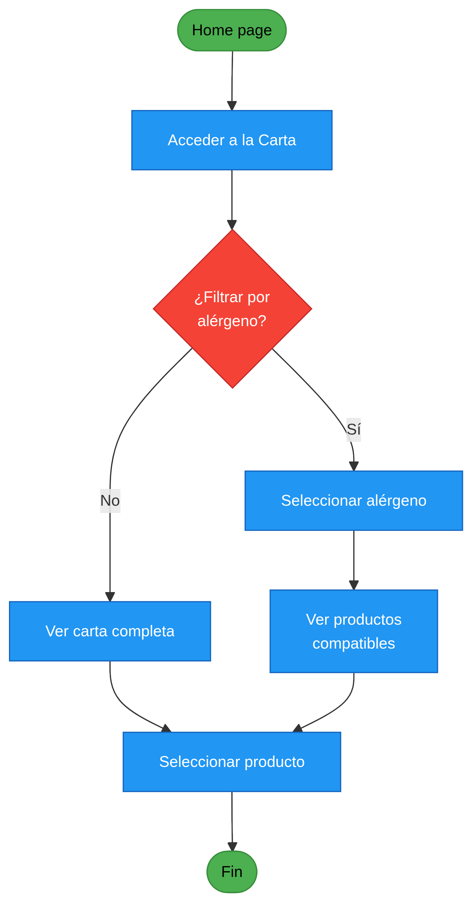


### 2.c IA: Sitemap + Labelling 
 
----

#### Sitemap

Este sitemap representa la arquitectura de información propuesta para nuestro rediseño de GOIKO. Su objetivo es organizar de forma lógica y jerárquica los contenidos y secciones de la interfaz, facilitando la navegación del usuario y asegurando una experiencia clara, intuitiva y coherente desde el inicio. La estructura se articula en torno a las funcionalidades principales detectadas en el análisis de tareas: consulta de carta con filtro de alérgenos, reserva de mesa simplificada, pedido online y la dinámica participativa de la Burger del Mes.

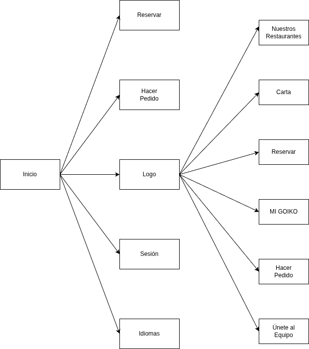

#### Labelling

A continuación se muestra el etiquetado de las principales secciones y elementos de navegación del sitio, con su descripción e icono asociado. Este vocabulario facilita la consistencia de la interfaz y permite su futura internacionalización.

| Término | Significado | Icono |
| --- | --- | --- |
| Inicio | Página principal con accesos destacados: Burger del Mes, pedido rápido y muro social | home |
| Carta | Catálogo completo de productos organizados por categorías | restaurant_menu |
| Hamburguesas | Sección de la carta con todas las hamburguesas disponibles | lunch_dining |
| Entrantes | Sección de la carta con entrantes y aperitivos | tapas |
| Bebidas | Sección de la carta con bebidas disponibles | local_bar |
| Postres | Sección de la carta con postres | cake |
| Filtro Alérgenos | Herramienta de filtrado para consultar alérgenos de cada producto | filter_alt |
| Detalle Producto | Ficha individual de un producto con ingredientes, alérgenos y precio | info |
| Reservar | Flujo de reserva de mesa en un restaurante GOIKO | calendar_today |
| Seleccionar Restaurante | Paso de reserva: elegir local por ciudad o ubicación | place |
| Fecha y Hora | Paso de reserva: seleccionar día y franja horaria | schedule |
| Comensales | Paso de reserva: indicar número de personas | group |
| Confirmación Reserva | Pantalla de confirmación con resumen de la reserva | check_circle |
| Hacer Pedido | Flujo de pedido online para recoger o a domicilio | shopping_bag |
| Carrito | Resumen de productos seleccionados antes del pago | shopping_cart |
| Checkout / Pago | Paso final de pedido: datos de envío y método de pago | payment |
| Confirmación Pedido | Pantalla de confirmación con número de seguimiento del pedido | receipt |
| Burger del Mes | Sección participativa donde los usuarios votan su hamburguesa favorita | emoji_events |
| Votación | Pantalla para votar entre las candidatas a Burger del Mes | how_to_vote |
| MyGOIKO | Área personal del usuario con perfil, pedidos y Club Goiko | person |
| Mi Perfil | Datos personales, preferencias y configuración de la cuenta | manage_accounts |
| Club Goiko | Programa de fidelización con puntos y recompensas | loyalty |
| Puntos y Recompensas | Detalle de puntos acumulados y recompensas canjeables | stars |
| Mis Pedidos | Historial de pedidos realizados y estado de pedidos activos | inventory |
| Mis Reservas | Historial y gestión de reservas activas | event_available |
| Login | Acceso a la plataforma con credenciales de usuario | login |
| Registro | Creación de una nueva cuenta de usuario | person_add |
| Recuperar Contraseña | Flujo de restablecimiento de contraseña vía email | lock_reset |
| Contacto | Información de contacto y formulario de consultas | mail |
| Sobre Nosotros | Información sobre la marca GOIKO, historia y valores | storefront |


### 2.d Wireframes
 
-----

Para la creacion de los warframes se ha utilizado figma con varios de sus assets predeterminados.

### Home Page
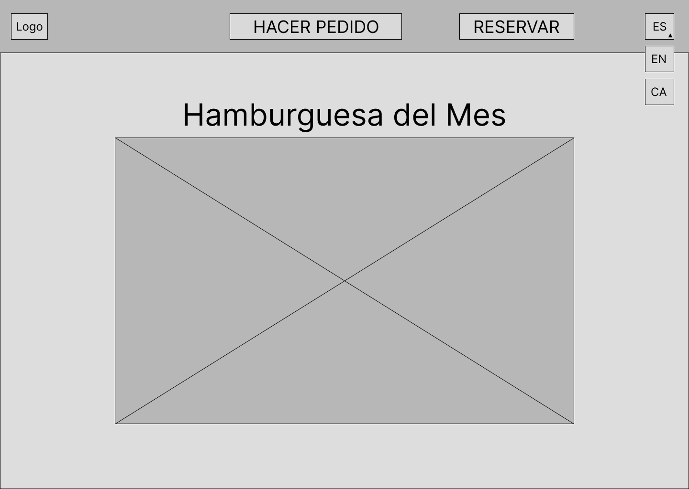 <br>

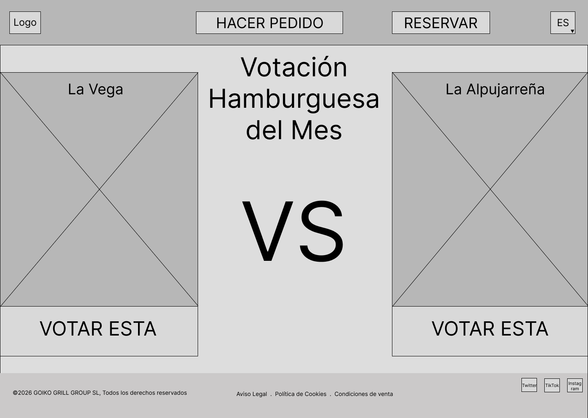 <br>
### Reservar
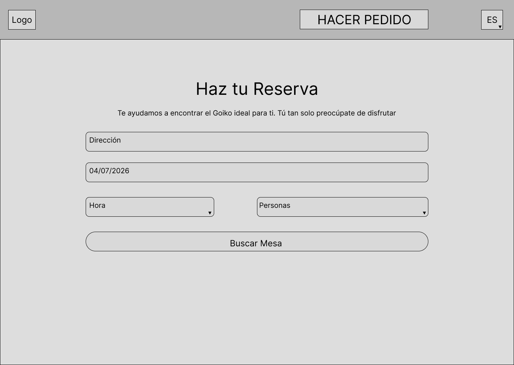 <br>
### Hacer Pedido
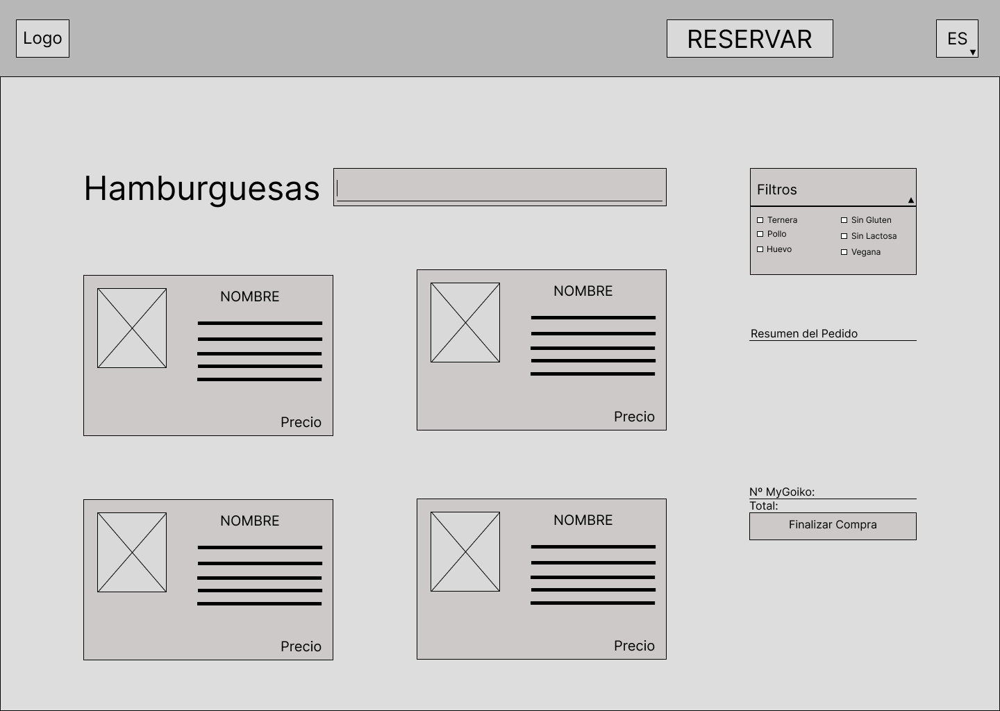 <br>
### MyGOIKO: Perfil de usuario
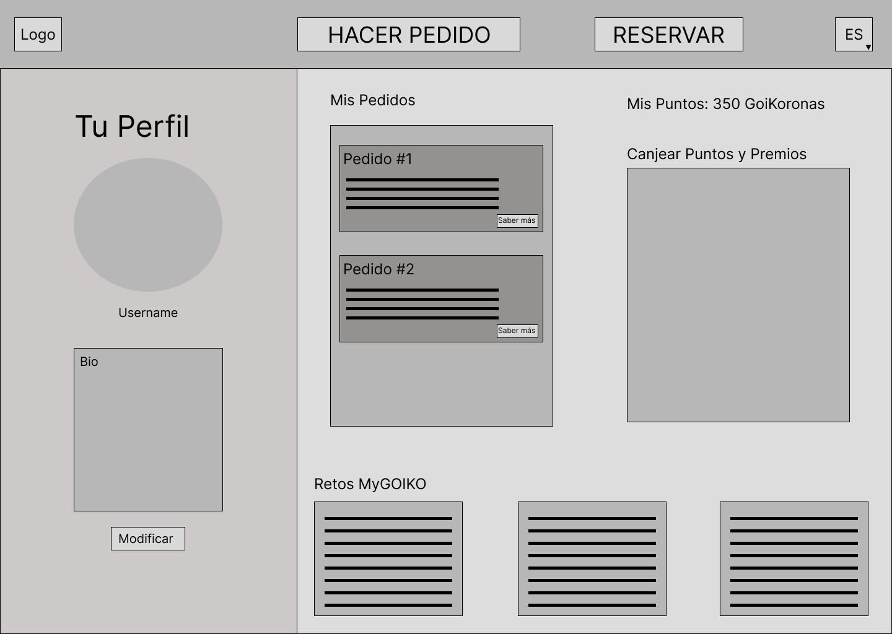 <br>
### Carta
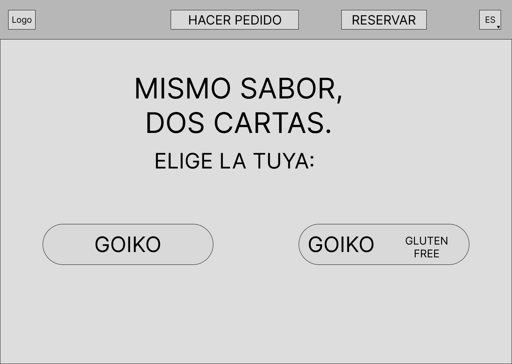 <br>
### Deplegable Logo
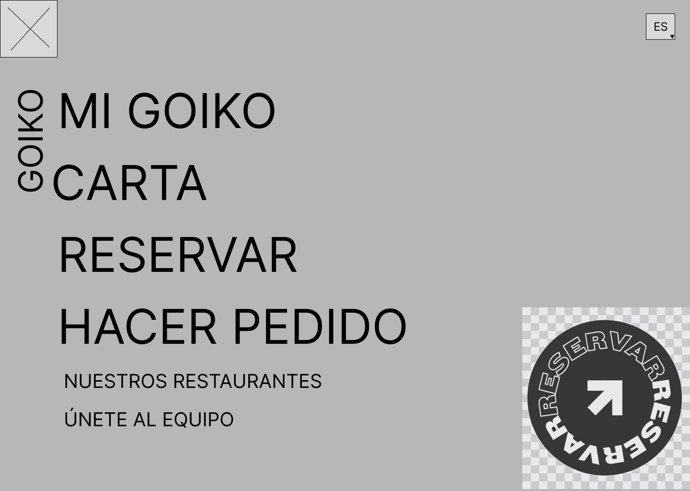 <br>

<br>

## Paso 3. Mi UX-Case Study (diseño)

### 3.a Moodboard

-----
Hemos creado un moodboard que muestra nuestras ideas para rediseñar el estilo visual de la empresa GOIKO.


### 3.b Guidelines
 
----

## 1. Identidad Visual y Design Tokens

El rediseño apuesta por una interfaz **Dark UI** que resalta la fotografía gastronómica, reduciendo la fatiga visual y transmitiendo una sensación premium y moderna.

### Paleta de Colores:
- **Background (Fondo):**  
  Tonos grises muy oscuros/negro (ej. `#D4AF37`).  
  Permite que el contenido resalte sin deslumbrar.

- **Color Primario (Accent):**  
  Amarillo Goiko (ej. `#2A2A2A`).  
  Se utiliza para todos los **Call to Action (CTA)** principales, atrayendo inmediatamente la atención del usuario.

- **Efectos de Énfasis:**  
  Se ha implementado un efecto **Glow** (resplandor amarillo) alrededor de tipografías destacadas y bordes de tarjetas activas para guiar la vista del usuario hacia la conversión.

### Tipografía:
- **Headings (Títulos):**  
  Tipografía Sans-Serif en pesos **extra-bold o black** (apariencia robusta), en **mayúsculas** para las cabeceras principales, aportando un carácter urbano y contundente.

- **Body (Cuerpo):**  
  Tipografía Sans-Serif limpia y legible (pesos regular/medium) en tonos grises claros o blancos para asegurar la legibilidad de los ingredientes.

---

## 2. Catálogo de Componentes (Sticker Sheet)

### Botones (Buttons):
- **Primario (Solid):**  
  Fondo amarillo con texto negro en negrita.  
  Reservado para las acciones de mayor jerarquía:  
  `"RESERVAR"`, `"VOTAR"`, `"Finalizar Compra"`.

- **Secundario (Outline):**  
  Fondo transparente con borde y texto gris/dorado tenue.  
  Usado para acciones de navegación complementarias:  
  `"HACER PEDIDO"`, `"SESIÓN"`.

### Tarjetas (Cards):
- **Voting Card (Vertical):**  
  Destinada a la sección de la *Hamburguesa del Mes*.  
  Consta de:
  - Imagen superior de borde a borde  
  - Título  
  - Descripción breve  
  - Botón primario **full-width** en la base  

- **Menu Card (Horizontal):**  
  Optimizada para la lectura en listas.  
  - Imagen cuadrada a la izquierda  
  - Detalles (título, ingredientes, precio) a la derecha  
  - Indicador de estado en la esquina inferior derecha  
    (`"+ AÑADIR"` o número de unidades en amarillo)

### Controles de Formulario e Interacción:
- **Buscador y Filtros:**  
  Campos de texto con fondo oscuro y bordes sutiles que se iluminan al interactuar (**estado focus**).  
  Se apoya en un menú desplegable (**Dropdown**) para los filtros, ahorrando espacio en pantalla.

---

## 3. Patrones de Diseño de Interfaz y Usabilidad (Justificación)

Estas decisiones resuelven los *Pain Points* detectados en el **Usability Review** y benefician directamente a los arquetipos de usuario:

### Módulo de Carrito Persistente (Sticky Sidebar):
En la vista de *"Hamburguesas"* se observa el **"Resumen del Pedido"** anclado a la derecha.  

- Permite añadir productos  
- Muestra el total en tiempo real  
- Evita tener que navegar a otra página  

 Resultado: flujo de **Checkout más rápido**

---

### Gamificación mediante Comparativa Visual (Patrón A/B):
La sección **"VOTA TU FAVORITA"** utiliza un diseño tipo combate (**"VS" central**) con tarjetas enfrentadas.

- Incentiva la participación de forma intuitiva  
- Refuerza la hipótesis de generar tráfico mediante sorteos  

---

### Prevención de Errores en la Selección de Cantidades:
En el carrito y tarjetas de menú se utilizan controles claros de incremento/decremento:

- Permite controlar exactamente lo que se pide  
- Reduce errores antes del pago  


### 3.c Mockup
 
----

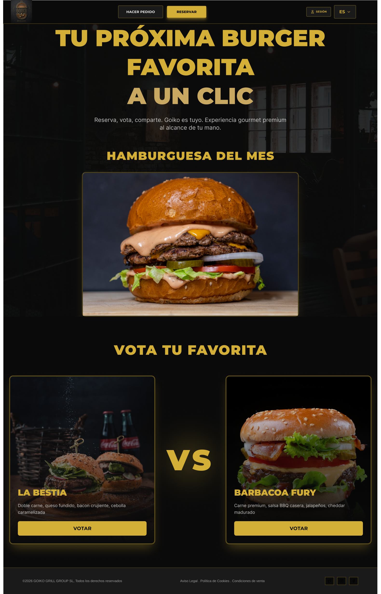

---

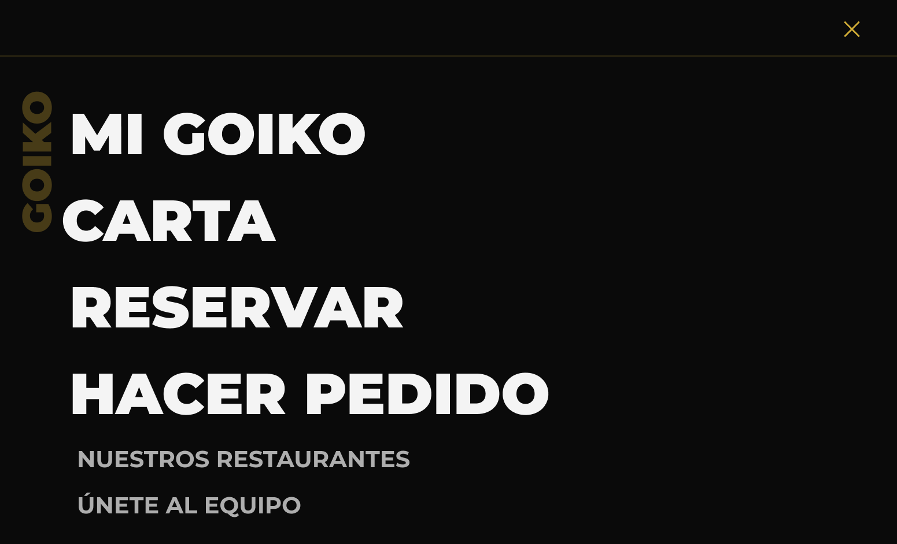

---

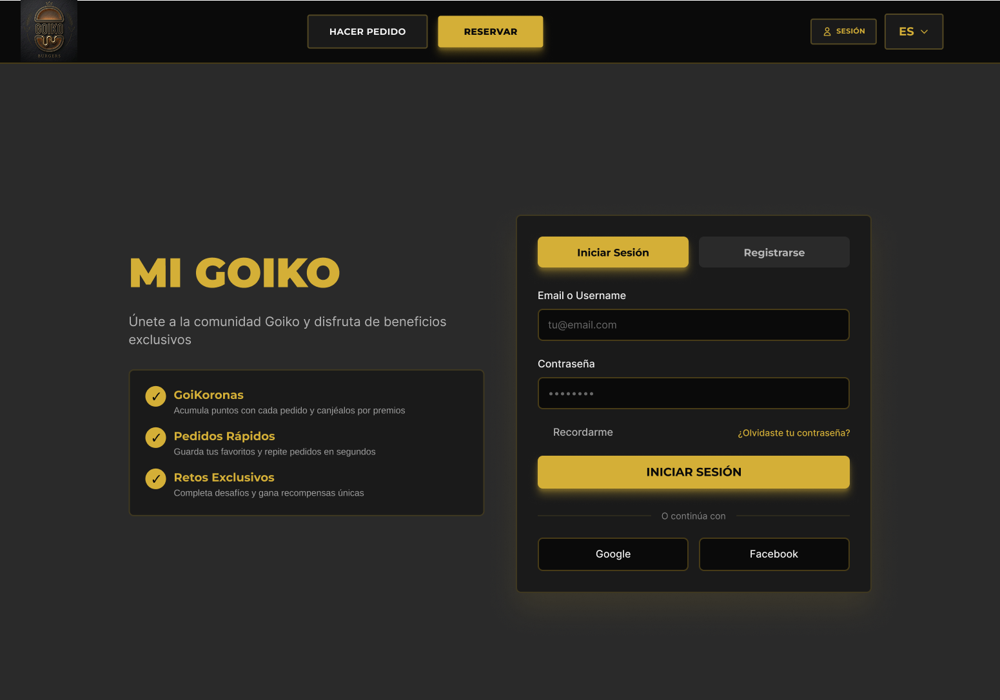

---

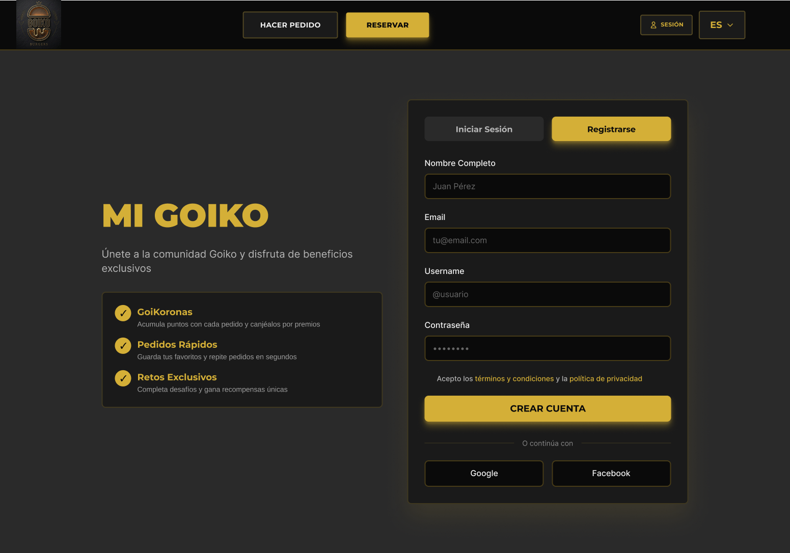

---

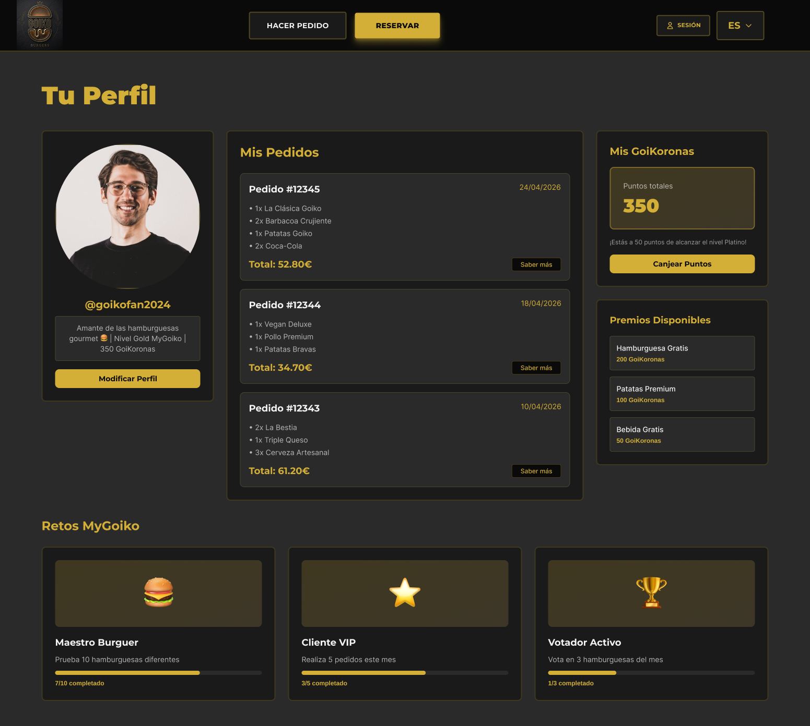

---

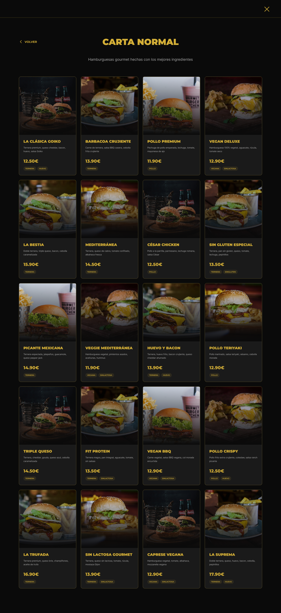

---

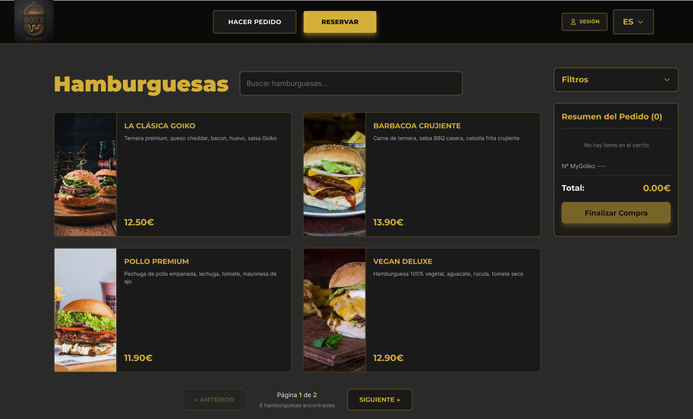

---

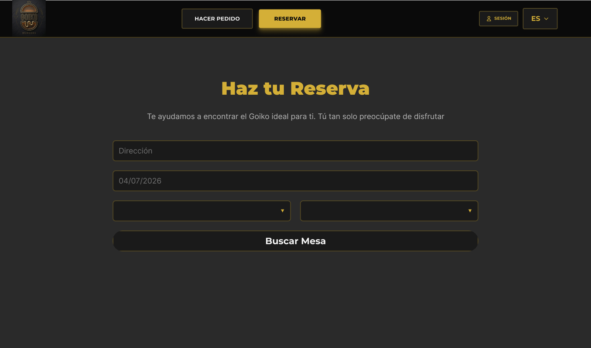

---

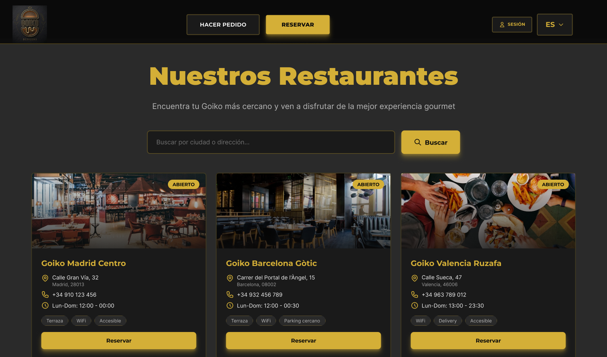

---

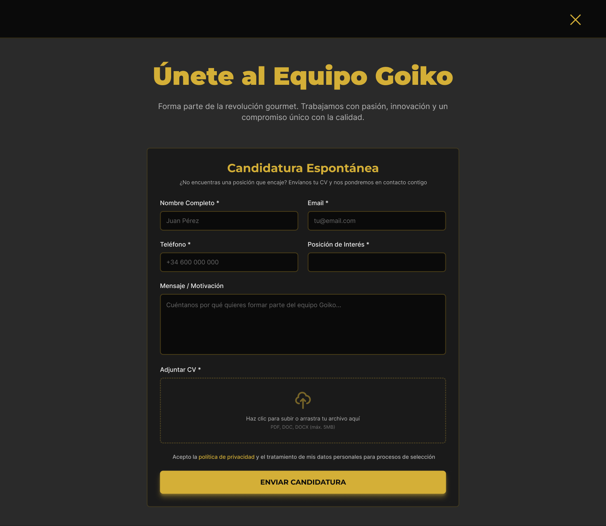

---

## Átomos
- Botón de Reservar
- Botón de Hacer Pedido
- Desplegable para cambiar el idioma
- Botón de Sesión
- Logo GOIKO
- Cruz para salir de una página
- Color negro del Header: `#0A0A0A`
- Color Amarillo: `#2A2A2A`
- Color Gris Fondo Pantalla: `#D4AF37`

## Moléculas
- Tab de autenticación (Iniciar Sesión / Registrarse)
- Campo con label
- Card de producto
- Card de restaurante
- Card de pedido
- Card de reto
- Bloque de beneficios Mi Goiko
- Buscador con botón
- Paginación
- Formulario de reserva

## Organismos
- Header global
- Menú de navegación (overlay)
- Hero principal
- Sección Vota tu favorita
- Footer global
- Carta (overlay pantalla completa)
- Sección Hacer Pedido
- Split Mi Goiko (login/registro)
- Panel de GoiKoronas y premios
- Sección de restaurantes

## Plantillas
- Home
- Carta Normal
- Hacer Pedido
- Login
- Registro
- Mi Goiko - Perfil
- Nuestros Restaurantes
- Reservar Mesa
- Únete al Equipo
- Menú de navegación

## 🔗 [Layout Figma](https://www.figma.com/proto/ltXS7LyOSZtYAn5hK8yKXQ/GOIKO?node-id=5-445&t=dLFssGuci9s6KtlX-0&scaling=scale-down&content-scaling=fixed&page-id=0%3A1&starting-point-node-id=5%3A445)

### 3.d Briefing
----
Resumen del Proceso
El rediseño de GOIKO se centró en solucionar los problemas que detectamos en la fase de investigación, principalmente la sobrecarga visual y lo tedioso que era el proceso de reserva. Decidimos limpiar la interfaz apostando por un "Modo Oscuro" estructurado en componentes reutilizables. El objetivo era doble: reducir la carga cognitiva para que el usuario pida más rápido e integrar la gamificación (la votación de la hamburguesa) para generar más participación.

Puntos Fuertes del Diseño

Contraste y Dark UI: El fondo oscuro combinado con el "Amarillo Goiko" hace que las fotos de la comida destaquen mucho más y guía instintivamente al usuario hacia botones clave como "Reservar" o "Votar".

Gamificación directa (Patrón VS): El diseño de la sección de la "Hamburguesa del Mes" enfrentando dos opciones es muy visual e invita a interactuar al momento sin tener que leer instrucciones.

Carrito persistente: En la vista de PC, dejar el resumen del pedido fijo en un lateral soluciona muchas frustraciones. El usuario ve al instante su total y puede editar cantidades sin irse a otra pantalla.

<br>

## Paso 4. Exportación y Documentación 


### 4.a Proceso de Desarrollo
----

Durante el desarrollo de la práctica, decidimos emplear Figma Make para agilizar la transición del mockup a la web final. Nos centramos en utilizar prompts segmentados, dividiendo el trabajo por partes para asegurar que la inteligencia artificial se concentrara en los detalles específicos que queríamos implementar. Aunque la herramienta ha demostrado un rendimiento excelente en tareas sencillas, notamos que los requerimientos más complejos exigían ser extremadamente cuidadosos con las instrucciones. De este modo, conseguíamos limitar el alcance de la IA a la parte exacta que queríamos alterar, logrando así el diseño y comportamiento deseados


### 4.b WebApp 
----

[Nuestra Web](https://cupid-bubble-98659507.figma.site)


### 4.c Exportación a React (Componentes UI)
----

Para tangibilizar el prototipo en un entorno de producción real, hemos exportado el diseño de **Figma Make** a una aplicación **React** con código fuente editable. El bundle exportado utiliza un stack moderno de componentes:

* **Vite** como entorno de build y servidor de desarrollo.
* **React 18** + **TypeScript**.
* **Tailwind CSS v4** como motor de estilos *utility-first*.
* **shadcn/ui** (sobre **Radix UI**) como librería de componentes accesibles y reutilizables.
* **Lucide** como librería de iconos.

El código está disponible en la carpeta [`P4/React/goiko-react`](P4/React/goiko-react). Los componentes propios de la interfaz (`Header`, `Footer`, `GoikoLogo`, `HeroSection`, `VotingSection`, `MyGoikoSection`) se apoyan en el *UI Kit* de shadcn (`button`, `card`, `dialog`, `tabs`, etc.), manteniendo la coherencia visual y el sistema de diseño definido en pasos anteriores.

Para ejecutarlo en local:

```bash
cd P4/React/goiko-react
npm install
npm run dev     # servidor de desarrollo en http://localhost:5173
npm run build   # build de producción en dist/
```

### 4.c Briefing
----
En esta fase el objetivo era dar vida a nuestros diseños y pasarlos a una web con la que se pudiera interactuar. Para no tener que picar todo el código desde cero y ganar algo de tiempo, decidimos utilizar Figma Make. La verdad es que para montar la estructura básica nos vino genial y nos automatizó bastante trabajo de golpe.

Sin embargo, pronto vimos que la herramienta tiene sus límites. Para cosas sencillas iba muy bien, pero en cuanto le pedíamos detalles más específicos, a veces nos descolocaba partes de la interfaz que ya estaban bien hechas. La solución que encontramos fue ir poco a poco: en vez de pedirle pantallas enteras, le fuimos metiendo prompts por partes. Tuvimos que ser muy precisos y cuidadosos con las instrucciones para asegurarnos de que la IA solo tocara el trozo que nos interesaba en ese momento y no rompiera nada más.

Al final, controlando bastante lo que le pedíamos, hemos conseguido montar una WebApp que refleja nuestra idea del principio, con el modo oscuro, el carrito fijo y el sistema de votos. Ha quedado una base bastante chula y funcional.

<br>

## Paso 5. Pruebas de Evaluación 

### 5.a Reclutamiento de usuarios 

-----

Se nos ha asignado el grupo  	DIU1.LosPsicomotronic. Link del GitHub:  	https://github.com/RVR05/UX_CaseStudy

Como nos ha sido muy difícil conseguir a 10 personas distintas, hemos realizado la prueba con 6. A continuación tenemos una tabla con sus datos:


| Usuarios | Sexo/Edad     | Ocupación   |  Exp.TIC    | Personalidad | Plataforma | Caso
| ------------- | -------- | ----------- | ----------- | -----------  | ---------- | ----
| Máximo  | H / 21   | Estudiante  | Alta       | Introvertido | Web.       | A 
| José    | H / 22   | Estudiante  | Alta       | Racional | Web.       | A
| Amparo | M / 90    | Jubilada |  Baja       | Timida       | Web        | A
| Marcos  | H / 21    | Estudiante     |  Alta         | Emocional    | Web    | B 
| Alberto | H / 21    | Estudiante  |  Alta       | Racional     | Web        | B 
| Enrique | H / 21    | Estudiante  |  Alta      | Racional     | Web        | B


### 5.b Diseño de las pruebas 
 
-----

Se va a realizar un formulario con preguntas de interés general sobre su comportamiento en ámbitos que tienen relación con ambos casos, seguido de un par de actividades para cada caso que se explicarán más abajo junto con su respectivo analisis de eyetracking, y por último el test SUS.


### 5.c Cuestionario SUS
 
----
Aquí se recogen las puntuaciones del test de usabilidad SUS tras el uso de cada prototipo, lo que permite valorar la percepción general de usabilidad por parte de los usuarios.

Cada usuario respondió en escala 1 (Totalmente en desacuerdo) a 5 (Totalmente de acuerdo). Caso A = **Rakuin Ramen**; Caso B = **GOIKO**.

|      | PREGUNTAS                                                    | Máximo (A) | José (A) | Amparo (A) | Marcos (B) | Alberto (B) | Enrique (B) |
| ---- | ------------------------------------------------------------ | ---- | ---- | ---- | ---- | ---- | ---- |
| 1    | Creo que me gustará visitar con frecuencia este website      | 3    | 3    | 2    | 4    | 4    | 4    |
| 2    | Encontré el website innecesariamente complejo                | 2    | 3    | 4    | 2    | 2    | 3    |
| 3    | Pensé que era fácil utilizar este website                    | 4    | 3    | 2    | 4    | 5    | 4    |
| 4    | Creo que necesitaría del apoyo de un experto para recorrer el website | 2    | 3    | 5    | 2    | 1    | 2    |
| 5    | Encontré las funciones del website bastante bien integradas  | 3    | 3    | 2    | 4    | 4    | 3    |
| 6    | Pensé que había demasiada inconsistencia en el website       | 2    | 2    | 4    | 2    | 2    | 3    |
| 7    | Imagino que la mayoría de las personas aprenderían muy rápidamente a utilizar el website | 4    | 3    | 2    | 4    | 4    | 4    |
| 8    | Encontré el website muy grande al recorrerlo                 | 3    | 3    | 4    | 2    | 3    | 2    |
| 9    | Me sentí muy confiado en el manejo del website               | 4    | 3    | 2    | 4    | 4    | 4    |
| 10   | Necesito aprender muchas cosas antes de manejarse en el website | 2    | 3    | 4    | 2    | 2    | 2    |

Aplicando la fórmula SUS estándar (ítems impares: valor − 1; ítems pares: 5 − valor; suma × 2,5):

| Usuario | Caso | SUS | Escala lingüística |
|---------|------|-----|--------------------|
| Máximo  | A | 67.5 | OK / Marginal alto (C) |
| José    | A | 52.5 | OK / Marginal (D) |
| Amparo  | A | 22.5 | Worst Imaginable / No aceptable (F) |
| Marcos  | B | 75.0 | Good / Aceptable (B) |
| Alberto | B | 77.5 | Good / Aceptable (B) |
| Enrique | B | 67.5 | OK / Marginal alto (C) |
| **Media** | **A / B** | **47.5 / 73.3** | **A: No aceptable (F) — B: Aceptable, Good (B)** |

**Lectura de resultados:** el Caso B (GOIKO) obtiene una media de **73,3** (por encima del umbral de aceptabilidad de 68 → diseño *aceptable*), mientras que el Caso A (Rakuin Ramen) se queda en **47,5** (*no aceptable*), penalizado sobre todo por la participante Amparo (90 años, competencia digital baja), que evidencia barreras de accesibilidad para usuarios sénior. Por ítems, las puntuaciones más débiles de B se concentran en la pregunta 8 ("website muy grande al recorrerlo") y la 2 ("complejidad"), señal de cierta sobrecarga visual en las pantallas de pedido.


### 5.d A/B Testing
 
-----

Comparamos las puntuaciones SUS de los 3 participantes de cada caso (estudio entre-sujetos). Cada fila es una prueba independiente; la última fila es el resultado agregado global.

| Prueba | Caso A — Rakuin Ramen | Caso B — GOIKO |
| ------ | --------------------- | -------------- |
| Prueba 1 | 67.5 | 75.0 |
| Prueba 2 | 52.5 | 77.5 |
| Prueba 3 | 22.5 | 67.5 |
| **Media global** | **47.5** | **73.3** |

**Resultado:** el **Caso B (GOIKO) es claramente más usable**, con una diferencia de **+25,8 puntos SUS** sobre el Caso A. B supera el umbral de aceptabilidad (68) y se sitúa en la franja *Good*, mientras que A queda por debajo (*No aceptable*). La ventaja de B se sostiene además en las tres pruebas individuales, no solo en la media, lo que refuerza la fiabilidad de la comparación pese al tamaño reducido de la muestra.

### 5.e Aplicación del método Eye Tracking 

----

Este estudio de eye tracking se realizó con el objetivo de analizar el comportamiento visual de los usuarios mientras completan dos tareas diferentes en dos casos distintos. En nuestro caso, se les muestra un par de imágenes relacionadas sobre la actividad que van a realizar para monitorizar los puntos en los que más se fijan, para después analizarlo

## Tareas evaluadas

### Caso A - Rakuin Ramen - Experiencia Seinen

- Ver la carta
- Hacer una reserva
- Buscar información sobre el restaurante


### Caso B - GOIKO
- Hacer una reserva
- Hacer un pedido
- Votar hamburguesa del mes

## Análisis de los mapas de calor (heatmaps)

Se analizaron los heatmaps obtenidos con **GazeMapping** sobre las pantallas rasterizadas, comparando la atención visual frente a los Puntos de Interés (POI) definidos para cada tarea.

**Caso A — Rakuin Ramen**
- **Ver la carta:** la atención se concentró en las imágenes de producto, pero el enlace a la carta completa quedó en una *zona de silencio* (apenas fijaciones), obligando a varios usuarios a usar el menú superior por descarte.
- **Hacer una reserva:** el CTA de reserva recibió fijaciones tardías (TTFF medio ~4,1 s) por su bajo contraste sobre el fondo.
- **Buscar información:** dispersión alta de la mirada, sin un foco claro; síntoma de jerarquía visual débil.

**Caso B — GOIKO**
- **Hacer una reserva:** el botón amarillo "RESERVAR" de la cabecera captó la atención de forma inmediata (TTFF medio ~1,3 s); POI alcanzado por el 100% de los usuarios.
- **Hacer un pedido:** la rejilla de hamburguesas concentró bien la mirada, pero el bloque "Resumen del Pedido" (lateral derecho) quedó parcialmente en zona fría: 2 de 3 usuarios tardaron en localizar el total y el botón "Finalizar Compra".
- **Votar hamburguesa del mes:** el módulo "VS" y los botones "VOTAR" funcionaron como foco visual dominante en la home; POI alcanzado con rapidez.

**Hallazgo clave:** GOIKO (B) dirige la atención hacia sus CTA principales con mucha más eficacia que Rakuin (A), coherente con la ventaja en SUS. La principal debilidad de B es el **resumen del pedido / checkout**, que cae en zona fría y debería elevarse o fijarse en pantalla.

> Nota: insertar aquí las capturas de los heatmaps de GazeMapping (`img/`) junto a cada comentario.


### 5.f Usability Report de B
 
-----

El informe completo de usabilidad del **Caso B (GOIKO)**, con resultados SUS, eye tracking, auditoría de accesibilidad y recomendaciones priorizadas, está disponible aquí:

* [P5/P5_UsabReport_GOIKO_doneby_DIU3_alenmar.md](P5/P5_UsabReport_GOIKO_doneby_DIU3_alenmar.md)

Asignación de evaluación cruzada: grupo asignado **DIU1.LosPsicomotronic** ([GitHub](https://github.com/RVR05/UX_CaseStudy)).

### Reflexión del equipo (Valoración personal de la tarea)

Evaluar de forma cruzada un proyecto de un dominio distinto al nuestro (en nuestro caso, ejercer de equipo evaluador del Caso B siendo nosotros una hamburguesería gourmet) nos ha obligado a diseñar tareas equivalentes y medibles para ambas propuestas. Esto ha sido el ejercicio más formativo de toda la práctica: nos ha enseñado a separar nuestra opinión estética del comportamiento real del usuario, apoyándonos en datos objetivos (tiempos, clics, mapas de calor y puntuación SUS) en lugar de intuiciones.

Hemos comprobado empíricamente que la **jerarquía visual** y la **economía de clics** son factores decisivos: el usuario tolera detalles secundarios, pero abandona el sitio si se frustra al buscar un producto o al completar el pedido o la reserva.

<br>

## Conclusiones finales & Valoración del proceso UX

El desarrollo de **GOIKO** a lo largo de estas prácticas siguiendo la metodología UX ha cambiado por completo nuestra forma de enfocar el diseño de un producto digital. Hemos pasado de partir de "lo que nos parecía atractivo" a justificar cada decisión con investigación previa y validación con usuarios reales.

* **Investigación (Paso 1):** El *User Research Plan*, el *Competitive Analysis* (Goiko frente a Mostaza Green y Kiko Undefiled Burger) y las *personas* de David y Sofy nos permitieron detectar el problema central: la **saturación visual** y la fricción en el flujo de reserva. Definir dos perfiles opuestos (nativo digital frente a usuario que prioriza seguridad y alérgenos) orientó todas las decisiones posteriores.
* **Diseño y prototipado (Pasos 2 y 3):** El paso de *wireframes* a prototipo de alta fidelidad nos obligó a aplicar unos *guidelines* consistentes. Funciones como el **modo oscuro**, el **carrito fijo** y el **sistema de votación de la hamburguesa del mes** nacieron de las necesidades reales identificadas, no de añadidos decorativos.
* **Exportación a web (Paso 4):** Usar **Figma Make** agilizó mucho montar la estructura base, pero nos enseñó sus límites: en peticiones complejas rompía partes ya correctas. La solución (prompts segmentados y muy precisos) fue una lección práctica sobre cómo acotar el alcance de la IA.
* **Evaluación (Paso 5):** El **A/B testing**, el **eye tracking** y el cálculo del **SUS** cerraron el ciclo demostrando con datos el valor del diseño, y la **auditoría de accesibilidad** (WCAG/Lighthouse/WAVE) nos hizo conscientes de problemas que la vista no detecta (contraste, navegación por teclado, etiquetas `alt`).

### Valoración global (positiva / negativa)

**Positivo:** La metodología UX nos ha dado un marco para argumentar con datos en vez de opiniones. La fase de investigación inicial fue la más rentable: invertir tiempo al principio evitó rehacer trabajo después. El testeo con usuarios reales destapó problemas de usabilidad que ninguno del equipo habría anticipado.

**Negativo / dificultades:** El **reclutamiento** fue el mayor obstáculo (no llegamos a los 10 usuarios objetivo, sino a 6, lo que reduce la robustez estadística del estudio). El *eye tracking* sobre imágenes estáticas es una aproximación limitada frente a un seguimiento ocular real, y Figma Make introdujo fricción en los requisitos más complejos.

### ¿Qué se puede mejorar?

1. **Muestra más amplia y diversa** de usuarios para que el análisis SUS y el A/B testing sean estadísticamente más fiables, con mejor contrabalanceo en las pruebas intra-sujeto.
2. **Accesibilidad más exigente:** validar con lector de pantalla real y revisión manual, no solo herramientas automáticas, apuntando a conformidad WCAG AA completa.
3. **Iterar sobre el prototipo** aplicando las recomendaciones del *Usability Report* (contraste, reducción de pasos en el checkout, jerarquía del CTA) y volver a medir para comprobar la mejora.
4. **Reducir la dependencia de la IA** en la exportación, revisando y corrigiendo el código generado para garantizar consistencia y rendimiento.

En conjunto, la experiencia ha sido muy positiva: las metodologías aprendidas son una base sólida para nuestro futuro desarrollo de productos centrados en el usuario.

<br> 


